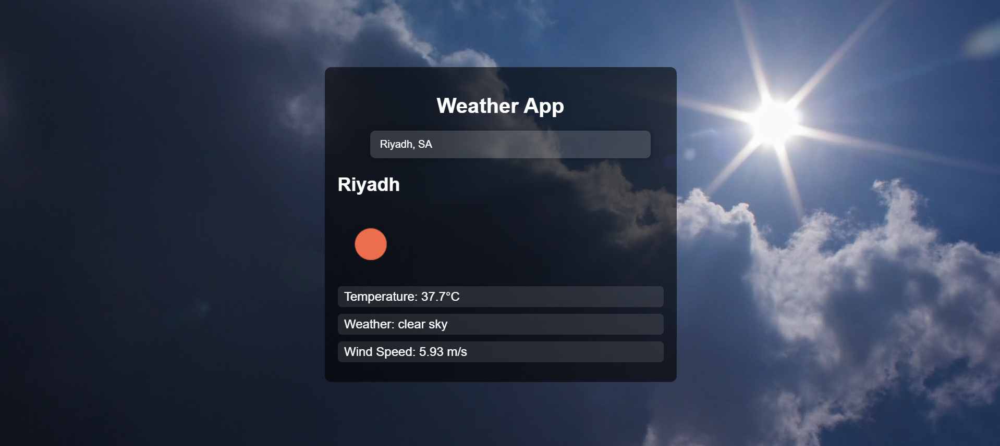

# Weather Forecast Web Application 🌍🌤️

## 🌐 Live Website  
[Click here to visit the Weather App](https://dilsara12.github.io/weather-web-ci/)

---

## 📖 Project Description  
This is a **Weather Forecast Web Application** built with **HTML, CSS, and JavaScript**.  
Users can **search for any city worldwide** and instantly get real-time weather data including:  
- 🌡️ Temperature  
- ☁️ Weather conditions  
- 💨 Wind speed  

The app is deployed using **GitHub Pages** and integrated with a **CI/CD pipeline** powered by GitHub Actions.

---

## ✨ Features  
- 🔍 Search weather by **any city name**  
- 🌡️ Displays temperature in °C  
- ☁️ Shows weather conditions (clear, cloudy, rain, etc.)  
- 💨 Displays wind speed  
- 🚀 Deployed free on GitHub Pages  
- 🔒 CI/CD with automated linting and security checks  

---

## 📷 Screenshot  
📌 Add a screenshot of your app, save it as `Screenshot1.png` in your repo.  
It will automatically display above.

---

---

## 🚀 Future Improvements  
- 🌍 Show 5-day forecast  
- 📱 Improve UI with a mobile-first responsive design  
- 🌙 Add Dark Mode toggle  
- 🗺️ Integrate map-based weather search  

---

## 👨‍💻 Author  
-**U.D.S. De Silva**  
Student ID: ITBIN-2211-0168  
Course: System Administration & Maintenance (IT31023)  
